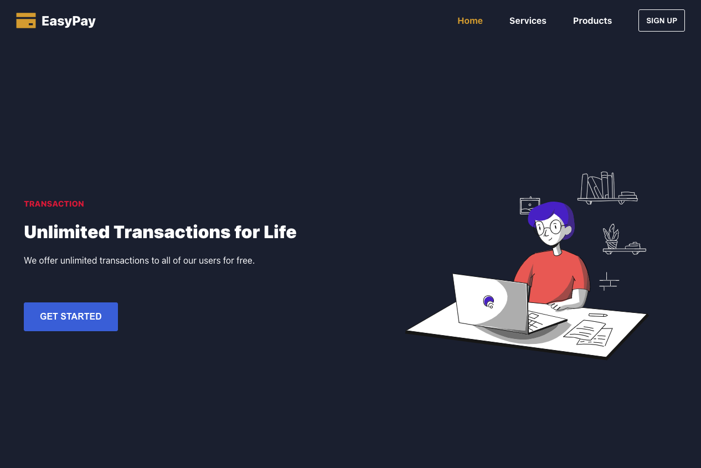

# 3. EasyPay (React.js)
## Screenshots

## Features
- Responsive (mobile / desktop)
- Animated illustrations
    → Play animation on hover
    → Lottie animation files (.json)
- Create a reusable component with a separate data file
    → hero
    → pricing cards
    → button (no separate data file)
- Create IsMobileContext to share desktop/mobile status across the app.

## Skills
- HTML
- CSS
- JS
- React.js
- Context API (React.js)
- Lottie (animated illustration)
- React Icons
- Components with separate data files